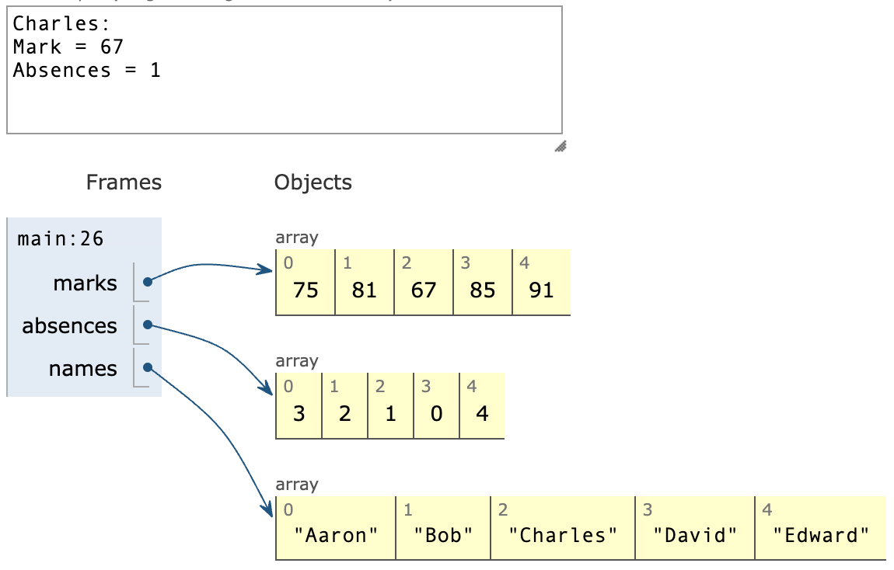

# 4.1 Introduction to Arrays

## Current Issues Representing Data

Consider a program that manages student marks for a class.  This program must be able to:
*  store a mark for 30 students
*  compute the average for of all the marks
*  display any mark upon request (i.e "show me the mark of the 4th student in the class list")

Up to this point, the only way we've been able to store data is via variables.  What issues arise when trying to represent the data in the program described above?

## What is an Array?
An array is a **<ins>DATA STRUCTURE</ins> (a way of storing data)** that allows you to programmatically specify one item from a list of items.  By using arrays, programs can gain enormous flexibility to handle large amounts of data.


* Arrays are a list of values 
    * A list of integers (e.g. list of student absences)
    * A list of doubles (e.g. list of student marks)
    * A list of Strings (e.g. list of names)
* An array can only store **one type of data**.  A single array could not store both integers and Strings.
* Each item in a list is called an **<ins>ELEMENT</ins>**.  
* Elements are arranged consecutively so you can refer to the first element, second element, and so on.
* Each array has a variable name associated with it.
* To specify an individual element in an array you must specify the variable name and an **<ins>INDEX</ins>** to the array. The **<ins>INDEX</ins>** is the number of the array element.


## Declaring an Array
Like regular variables, the data type of an array must be specified when the array is declared.  It looks similar to a regular variable declaration, except that square brackets `[]` appear after the base type:

```java
int[] marks;
```

* The **<ins>BASE DATA TYPE</ins>** (in this case int), specifies the data type of the individual elements in the array.
* The `[]` notifies the compiler that the declaration is for an array.
* You can also declare an array of objects like Strings, where each element is a string object

```java
String[] names;
```

The declaration does not actually create the array, it merely tells the compiler that the variable will be used to store an array.

## Creating an Array
To create an array:
1. we use the `new` keyword
2. followed by the name of the base data type
3. followed by the number of elements in the array in square brackets

Together with the declaration, an array creation look like this:

```java
int[] marks; // Declares an array called `marks`
marks = new int[30]; // Initalizes marks with 30 elements in the arry
```

or we can combine the statements
```java
int[] marks = new int[30];
```

Here we create an array of Strings:
```java
String[] names;
names = new String[30];
```

### Default Element Values
When an array of a numeric data type like `int` or `double` is created, each element is initialized to **<ins>zero</ins>**.  When it is an array of objects like `String` is created, the elements have default value of `null`.

## Setting Element Values
Array elements can be assigned values via assignment statements.  

```java
int[] marks;
marks = new int[30];

marks[0] = 75;
marks[1] = 81;
marks[2] = 67;
marks[3] = 85;
marks[4] = 91;

etc.
```

## Initializing an Array
Another option of filling in your array with elements is to initialize the entire array at the beginning:
```java
int[] absences = {4, 3, 6, 8, 9};
```

In the declaration above, we can create an array with a predefined set of values.  The size will be automatically set by the number of values listed. No `new` statement required. This is called an **<ins>ARRAY INITIALIZER</ins>**.

Consider an array `daysInMonth` that stores the numbers of days in each month.

```java
int[] daysInMonth;
daysInMonth[0] = 31;
daysInMonth[1] = 28;
daysInMonth[2] = 31;
…
```

Instead of going through the tedious task of a single assignment per element, we can use and array initializer:
```java
int[] daysInMonth = {31, 28, 31, 30, 31, 30, 31, 31, 30, 31, 30, 31};
```
To reference the number of days in April, I would use `daysInMonth[3]`

## Accessing Elements of an Array
* To access an element of the array, you give the array name followed by the index to the array element in the square brackets.
* The index can be an integer `marks[4]`, a variable `marks[num]`, or an expression that results in an integer `marks[x + 1]`
* To access the `nth` element, we use the `n-1` index. 
  * E.g. The `first` element is in index `0` so to access the first element, we use: `marks[0]`

### Example - Printing out the 3rd element in an array
```java
System.out.println(marks[2]);

class Example1 extends ConsoleProgram {
    public void run() {
      int[] marks;
      marks = new int[5];

      marks[0] = 75;
      marks[1] = 81;
      marks[2] = 67;
      marks[3] = 85;
      marks[4] = 91;

      int[] absences = {3, 2, 1, 0, 4};

      String[] names;
      names = new String[5];

      names[0] = "Aaron";
      names[1] = "Bob";
      names[2] = "Charles";
      names[3] = "David";
      names[4] = "Edward";

      System.out.println(names[2] + ":");
      System.out.println("Mark: " + marks[2]);
      System.out.println("Absences: " + absences[2]);
    }
}
```
Here is a visual representation of what is stored in each array and what the output is:


# You Try
1. Create an `int` array called `canCounts` that stores the number of cans collected for 5 homerooms. Assign values to the elements in the array. Print out the first and last element values.
2. Create an array of `Strings` called `top5` that stores your 5 favourite song names. Print out the song in the middle of the array.
3. Create a `double` array called `menuItems` that stores the prices of 6 menu items. Use a **predefined array** to create this. Print out the price of the second last item.